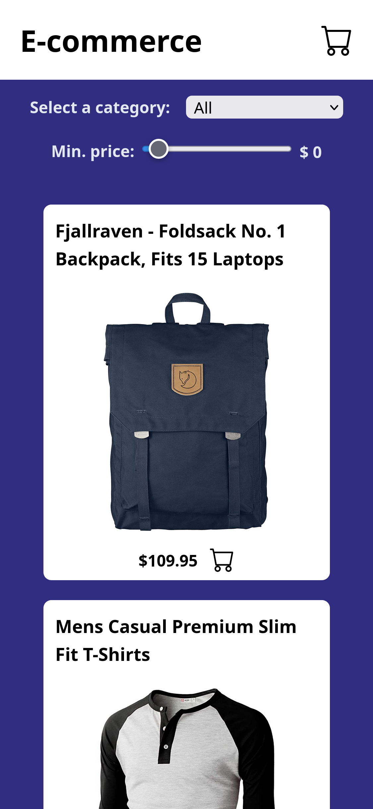
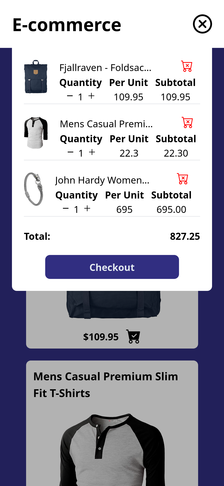
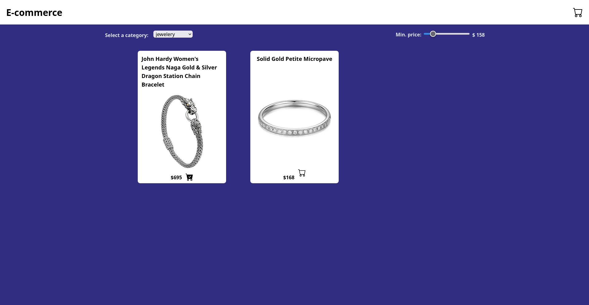

# E-commerce

## Table of contents

- [Overview](#overview)
  - [The challenge](#the-challenge)
  - [Screenshot](#screenshot)
  - [Links](#links)
- [My process](#my-process)
  - [Built with](#built-with)
  - [Useful resources](#useful-resources)
- [Author](#author)
- [Acknowledgments](#acknowledgments)

## Overview

### The challenge

Users should be able to:

- View the optimal layout for the site depending on their device's screen size
- See hover states for all interactive elements on the page
- Be able to filter the products by price and or category
- Add items to the cart by clicking on an icon in the product
- Icons on the product must represent if the prodyct is or isn't in the cart
- View the cart and remove items from it
- Add or reduce the number of items for a certain product in the cart
- Read the total amount of money they need to pay for the products in the cart
- Checkout the items from their carts and the cart must have no items after that
- After checking their products out, users should see a new view thanking them

### Screenshots

  

    
    
  

  

    
  

### Link

- Live Demo: [https://ecommerce-chichodev.netlify.app/](https://ecommerce-chichodev.netlify.app/)

### Built with

- Mobile-first workflow
- Semantic HTML5 markup
- Tailwind CSS
- Flexbox
- CSS Grid
- Fetch API
- [React](https://reactjs.org/) - JS library
- [Typescript](https://www.typescriptlang.org/) - Strongly typed programming language that builds on JavaScript

### Useful resources

- [Fake Store Api](https://fakestoreapi.com/) - This resource was essential for building this e-commerce since it has the API docs.

## Author

- Website - [My Porfolio](https://guillermo-portfolio.netlify.app/)
- LinkedIn - [Guillermo Sanchez](https://www.linkedin.com/in/guillermo-sanchez-52a616268)
